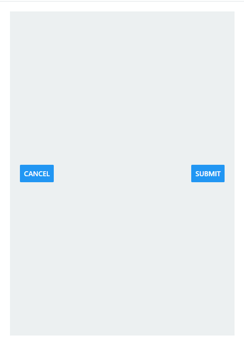

# Flexbox

Here's a quick summary of all the essential Flexbox attributes in React Native to help you get up and running with layout design.

## Flex Container Properties

### `flexDirection`

- Defines the main axis direction (horizontal or vertical).
- Values:
  - `row`: Horizontal layout.
  - `column`: Vertical layout (default).
  - `row-reverse`: Reverse horizontal layout.
  - `column-reverse`: Reverse vertical layout.

### `justifyContent`

- Aligns items along the main axis.
- Values:
  - `flex-start`: Aligns items to the start.
  - `center`: Centers items.
  - `flex-end`: Aligns items to the end.
  - `space-between`: Even space between items.
  - `space-around`: Even space around items.
  - `space-evenly`: Equal space around all items.

### `alignItems`

- Aligns items along the cross axis (perpendicular to `flexDirection`).
- Values:
  - `flex-start`: Aligns items to the start of the cross axis.
  - `center`: Centers items on the cross axis.
  - `flex-end`: Aligns items to the end of the cross axis.
  - `stretch`: Stretches items to fill container.

### `flexWrap`

- Allows items to wrap onto multiple lines if needed.
- Values:
  - `nowrap`: No wrapping (default).
  - `wrap`: Wrap items onto multiple lines.
  - `wrap-reverse`: Wrap items in reverse order.

### `alignContent`

- Controls spacing between rows or columns when using wrapping.
- Values:
  - `flex-start`: Aligns lines to the start.
  - `center`: Centers lines in the container.
  - `flex-end`: Aligns lines to the end.
  - `space-between`: Even space between lines.
  - `space-around`: Even space around lines.
  - `stretch`: Stretches lines to fill the container.

## Flex Item Properties

### `flex`

- Defines how an item grows relative to others in the container.
- *Example*: `flex: 1` allows the item to take available space proportionally.

### `alignSelf`

- Overrides alignItems for a single item.
- Values:
  - `auto`: Follows `alignItems` setting.
  - `flex-start`: Aligns item to the start of the cross axis.
  - `center`: Centers item on the cross axis.
  - `flex-end`: Aligns item to the end of the cross axis.
  - `stretch`: Stretches item to fill container.

### `order`

- Sets the display order of the item (default is 0).
-Lower values appear first in the layout.

## Common Flexbox layout use cases

### Making an Item Fill the Parent

```javascript
import React from 'react';
import { View, Text, StyleSheet } from 'react-native';

export default function FillParentExample() {
  return (
    <View style={styles.parent}>
      <View style={styles.child}>
        <Text style={styles.text}>This fills the parent!</Text>
      </View>
    </View>
  );
}

const styles = StyleSheet.create({

});
```


### Horizontal Button Row

```javascript
import React from 'react';
import { View, Button, StyleSheet } from 'react-native';

export default function HorizontalButtonRow() {
  return (
    <View style={styles.buttonRow}>
      <Button title="Cancel" onPress={() => {}} />
      <Button title="Submit" onPress={() => {}} />
    </View>
  );
}

const styles = StyleSheet.create({

});

```



### Columnar Form Layout (Single Column Form)

```javascript
import React from 'react';
import { View, TextInput, Button, StyleSheet } from 'react-native';

export default function SingleColumnForm() {
  return (
    <View style={styles.formContainer}>
      <TextInput style={styles.input} placeholder="Username" />
      <TextInput style={styles.input} placeholder="Password" secureTextEntry />
      <Button title="Login" onPress={() => {}} />
    </View>
  );
}

const styles = StyleSheet.create({

});

```


### Scrollable List (Vertical List)

```javascript
import React from 'react';
import { ScrollView, View, Text, StyleSheet } from 'react-native';

export default function VerticalList() {
  const items = Array.from({ length: 20 }, (_, i) => `Item ${i + 1}`);
  return (
    <ScrollView style={styles.container}>
      {items.map((item, index) => (
        <View key={index} style={styles.listItem}>
          <Text>{item}</Text>
        </View>
      ))}
    </ScrollView>
  );
}

const styles = StyleSheet.create({

});
```


### Grid Layout (e.g., Image Gallery)

```javascript
import React from 'react';
import { View, StyleSheet } from 'react-native';

export default function GridLayout() {
  return (
    <View style={styles.gridContainer}>
      {[...Array(8)].map((_, i) => (
        <View key={i} style={styles.gridItem} />
      ))}
    </View>
  );
}

const styles = StyleSheet.create({

});
```


### Centered Single Item (Center-Aligned Content)

```javascript
import React from 'react';
import { View, Text, StyleSheet } from 'react-native';

export default function CenteredContent() {
  return (
    <View style={styles.centerContainer}>
      <Text style={styles.text}>Centered Item</Text>
    </View>
  );
}

const styles = StyleSheet.create({

});
```


### Header and Footer with Main Content in Between

```javascript
import React from 'react';
import { View, Text, StyleSheet } from 'react-native';

export default function HeaderFooterLayout() {
  return (
    <View style={styles.container}>
      <View style={styles.header}><Text>Header</Text></View>
      <View style={styles.mainContent}><Text>Main Content</Text></View>
      <View style={styles.footer}><Text>Footer</Text></View>
    </View>
  );
}

const styles = StyleSheet.create({

});
```


### Two-Column Layout (Side-by-Side Form Fields)

```javascript
import React from 'react';
import { View, TextInput, StyleSheet } from 'react-native';

export default function TwoColumnForm() {
  return (
    <View style={styles.twoColumnContainer}>
      <TextInput style={styles.columnItem} placeholder="First Name" />
      <TextInput style={styles.columnItem} placeholder="Last Name" />
    </View>
  );
}

const styles = StyleSheet.create({

});
```


### Footer with Fixed Height and Scrollable Content Above

```javascript
import React from 'react';
import { View, Text, ScrollView, StyleSheet } from 'react-native';

export default function FooterLayout() {
  return (
    <View style={styles.container}>
      <ScrollView style={styles.scrollableContent}>
        <Text style={styles.text}>Scrollable Content</Text>
        {/* Add more content here */}
      </ScrollView>
      <View style={styles.footer}>
        <Text>Footer</Text>
      </View>
    </View>
  );
}

const styles = StyleSheet.create({

});
```


### Full-Width Input Fields in a Column Layout

```javascript
<View style={styles.container}>
  <TextInput style={styles.input} placeholder="Full-width input" />
  <TextInput style={styles.input} placeholder="Another full-width input" />
</View>

const styles = StyleSheet.create({

});
```


### Button or Image that Stretches to Full Width

```javascript
<View style={styles.buttonContainer}>
  <Button title="Full-Width Button" onPress={() => {}} />
</View>

const styles = StyleSheet.create({

});
```


### Responsive Card or Item Layout in a Row

```javascript
<View style={styles.rowContainer}>
  <View style={styles.card}><Text>Card 1</Text></View>
  <View style={styles.card}><Text>Card 2</Text></View>
  <View style={styles.card}><Text>Card 3</Text></View>
</View>

const styles = StyleSheet.create({

});
```


### Vertical List of Cards that Fill Container Width

```javascript
<View style={styles.listContainer}>
  <View style={styles.card}><Text>Item 1</Text></View>
  <View style={styles.card}><Text>Item 2</Text></View>
  <View style={styles.card}><Text>Item 3</Text></View>
</View>

const styles = StyleSheet.create({

});
```


### Tow items, one size itself base on content, the other stretch


### Columnar Form Layout (Tow Column Form)

```javascript
import React from 'react';
import { View, Text, TextInput, Button, StyleSheet } from 'react-native';

export default function SingleColumnFormWithLeftLabels() {
  return (
    <View style={styles.formContainer}>
      <View style={styles.formGroup}>
        <View style={styles.labelContainer}>
          <Text style={styles.label}>Username</Text>
        </View>
        <TextInput style={styles.input} placeholder="Enter your username" />
      </View>

      <View style={styles.formGroup}>
        <View style={styles.labelContainer}>
          <Text style={styles.label}>Password</Text>
        </View>
        <TextInput style={styles.input} placeholder="Enter your password" secureTextEntry />
      </View>

      <View style={styles.formGroup}>
        <View style={styles.labelContainer}>
          <Text style={styles.label}>Confirm Password</Text>
        </View>
        <TextInput style={styles.input} placeholder="Confirm your password" secureTextEntry />
      </View>

      <Button title="Login" onPress={() => {}} />
    </View>
  );
}

const styles = StyleSheet.create({


});
```


### Columnar Form Layout

```javascript
import React from 'react';
import { View, Text, TextInput, Button, StyleSheet } from 'react-native';

export default function SingleColumnFormWithLabels() {
  return (
    <View style={styles.formContainer}>
      <View style={styles.formGroup}>
        <Text style={styles.label}>Username</Text>
        <TextInput style={styles.input} placeholder="Enter your username" />
      </View>

      <View style={styles.formGroup}>
        <Text style={styles.label}>Password</Text>
        <TextInput style={styles.input} placeholder="Enter your password" secureTextEntry />
      </View>

      <Button title="Login" onPress={() => {}} />
    </View>
  );
}

const styles = StyleSheet.create({

});
```

